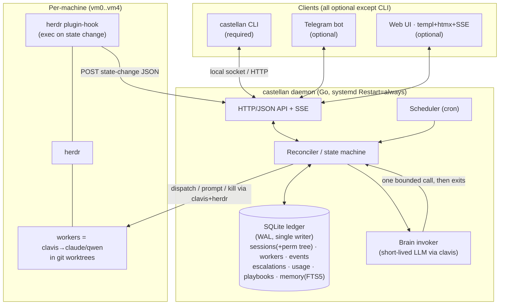

# Castellan — Overview & Roadmap (readable plan)

> The keeper of the keep. A self-hosted daemon that supervises a fleet of coding-agent workers (clavis→claude/qwen/…) across your machines, decides what to do when they finish or block, and is driven from the CLI — with optional Telegram and Web dashboards.
> Companion: the full design rationale is in `../specs/2026-08-04-manager-harness-blueprint.md`. The engineer-facing build plan is `2026-08-04-castellan-impl-plan.md`.

> **Rev 3 (2026-08-04)** — introduces five threads: **sessions** (the first-class unit of work + conversation that owns workers across VMs), a **context-balance policy** (durable per-session brain transcript + opportunistic warm prefix; never a warm process), a **4-tier memory** system with off-hot-path hindsight write-back, a **Telegram forum-topic UX** (one topic per session), and **autonomy-first control** (no per-action approval gates; a per-session capability tree compiled onto each worker; two-level question answering; tiered grants). The core shape (durable Go daemon + SQLite ledger + short-lived brain) is unchanged.

## What it is, in one breath
`clavis` launches workers · `herdr` herds them on each machine · **`castellan` keeps the whole keep** — one durable Go daemon that owns the truth about every worker, reacts to their state changes, calls an LLM "brain" only when a decision is needed, and reports to you.

---

## Design rules (non-negotiable)
- **CLI-first, headless-complete.** Everything works with just the daemon + `castellan` CLI. No web, no Telegram required.
- **Optional clients.** Telegram (phone) and Web UI (browser) are *add-ons* that read/drive the same API. If they're off, nothing breaks.
- **Sessions are the unit of work AND conversation.** A session owns a group of workers (possibly across VMs), holds its own context (a durable brain transcript + rolling summary), and carries a versioned capability tree. A session is a data grouping + context scope — **never a resident process** (that would reintroduce the banned long-lived-LLM model).
- **The daemon owns the truth.** A durable SQLite ledger is the source of truth for worker + session state — not the LLM's memory, not a UI.
- **The LLM is a short-lived guest.** The brain is invoked per-event for a bounded decision, then exits. Nothing long-running is an LLM process → no leaks, bounded cost, crash-safe. Coherence comes from what we *assemble each event* (a byte-stable, ledger-backed session transcript), not from a living context.
- **Autonomy-first, not approval-gated.** Workers act on **routine** actions with no gate. Only a **stuck/ambiguous** worker asking a *question* or a **danger/irreversible** action needing a *confirm* interrupts. Questions are answered **two-level**: castellan's own brain answers from session context + user memory + playbooks first; it escalates to the human only when it is itself uncertain OR the action is danger-class.
- **Least privilege by capability tree.** Each session has a permission tree (default: anything in its own worktree + open/update PRs; NOT merge, NOT main/shared, NOT deploy/spend/send/read-secrets). Workers inherit a narrowed copy; the operator widens a session with explicit grants. Enforcement is defense-in-depth: compiled onto the worker's Claude Code config AND re-checked at castellan's own action boundary (authoritative). High-blast capabilities are never handed to the worker.
- **A worker's output is never applied blindly.** It's classified → reconciled through castellan's state machine → persisted → guarded → then it drives the next action.
- **Push is an optimization, not the truth.** herdr events are fast hints; an authoritative **periodic reconcile sweep** (process liveness + git HEAD) repairs the ledger even when events are dropped. Event intake is **idempotent** (stable IDs, dedup-on-admit) so re-delivery and restarts never double-apply.
- **Crash-safe by construction.** Every decision and side-effect records **intent → execute → result**, so after a crash castellan can tell "decided to spawn X" apart from "X actually spawned" (no double-spawn, no lost work).
- **The brain is cheap by default.** Because each event rebuilds context (and a sparse-event homelab often misses the prompt cache), the per-event brain runs on a **cheap/fast model**; a strong model is escalated to only for genuinely hard decisions. Token+cache cost is measured.

---

## Feature list

### Core (required — daemon + CLI)
- **Sessions** — the first-class unit of work + conversation. A session (`open, active, waiting, idle, done, archived`) owns a group of workers across VMs, holds its own context (durable brain transcript + rolling summary), a versioned capability tree, and its Telegram-topic binding. Subsumes the old flat "jobs" concept.
- **Worker ledger** — every worker tracked with rich state (`starting, running, waiting_for_user, waiting_for_confirmation, blocked, completed_candidate, completed_verified, failed, paused, killed`), its `owner_session`, VM, worktree, base commit, task, effective capability tree, and last event.
- **Capability tree + grants** — per-session permission tree (git/fs/exec/external/fleet), inherited narrow-only by workers, compiled onto each worker's Claude Code config at spawn and re-checked at castellan's action boundary. `castellan grant/revoke`; every change is an audit event.
- **Context balance** — each session keeps a durable brain transcript (soft-archived, FTS-searchable, never deleted) reassembled byte-stably each event; opportunistic prompt-cache while warm; checkpoint folds it into a bounded rolling summary on idle/threshold. Crash-safe like statelessness, coherent like a warm context, no warm process.
- **4-tier memory** — whole-file `USER.md` (always-hot) + `MEMORY.md` index/topic files (JIT) + per-session facts/summary/FTS5 + playbooks. Off-hot-path hindsight write-back proposes typed memory diffs (human-approved); a curator ages topic facts to avoid drift.
- **Event intake** — herdr's plugin-hook fires castellan on every worker state change (real push, not polling); a poll loop is the fallback.
- **State fusion** — "is this worker done/blocked?" decided from herdr events + transcript + process liveness + git HEAD changes + (only when ambiguous) a short LLM classification.
- **The brain** — a short-lived LLM call (via clavis, swappable model) invoked to: pick the next worker, decide next action, replan on stall, or classify an ambiguous state.
- **Worker lifecycle** — spawn (via clavis) into a git worktree, track, pause/resume, kill, restart; before/after HEAD diffing.
- **Dispatch & routing** — assign tasks to workers; the daemon owns routing (workers don't route themselves); handoff (transfer ownership) vs subtask (bounded helper).
- **Escalations (questions + confirms)** — autonomy-first: routine actions never gate. A stuck worker's *question* is answered by castellan's brain first (two-level) and only reaches you if castellan is uncertain; a danger-class action becomes a durable *confirm*. Grants tier: medium-risk can be promoted to a standing session grant by one tap; high-blast (push main, deploy, spend, destructive delete) is per-action-once only, standing grants requiring a deliberate CLI `castellan grant`.
- **Durable everything** — idempotent append-only event log (stable IDs, two clocks), intent→execute→result for every action, crash recovery, orphan cleanup on boot.
- **Authoritative reconcile sweep** — a periodic pass repairs worker state from process-liveness + git HEAD, so a dropped/duplicated event never desyncs the fleet.
- **Concurrency that scales** — decisions serialize *per worker* but run *concurrently across workers*; brain calls run off the write path; spawn throttle + jittered backoff for provider 429s.
- **Pause/resume** — park idle workers (commit → detach → reclaim worktree/PTY), resume later — required to reach hundreds of workers on finite machines.
- **Diff-gated completion** — a worker only moves `completed_candidate → completed_verified` after its base→head diff is reviewed (human or auto-verifier), not on a guess.
- **Scheduler** — castellan can schedule its own follow-ups (cron); natural-language → schedule.
- **Cost accounting** — per-worker/per-model token+cost, first-class.
- **CLI** — `castellan status | sessions | session | workers | dispatch | grant | revoke | answer | logs | attach | pause | resume | kill | schedule | playbook`.

### Optional add-on: Telegram (forum-topic UX)
- **One private forum supergroup; one topic per session.** Typing in a topic talks to that session — routing is structural, no "current focus" to desync. Precedent: OpenClaw ships per-topic sessions.
- **Per-topic pinned status card** updated in place (no notification spam); discrete messages only for questions, confirms, blocks/failures, and completed-candidate diffs.
- **General topic = fleet console** + mute-safe escalation mirror (mute busy sessions per-topic; critical items still surface in General).
- **Escalation buttons** — `[✅ This once] [✅ Always for session] [❌ No] [👀 Diff]`; the "Always" button is hidden for high-blast tiers.
- Two-way control from your phone: query status, dispatch (creates a session+topic), answer questions, confirm danger actions.

### Optional add-on: Web UI (server-rendered Go, no JS build)
- Live **session board** (columns = status); session detail renders the same `events WHERE session_id=?` stream as the Telegram topic — one session model, two renderers.
- Dispatch tasks, answer questions / confirm danger actions, grant/revoke capabilities, pause/kill, browse playbooks & schedules.
- Read-only-safe: it's a client of the daemon API; turning it off changes nothing.

### Later: the learning edge
- **Playbook store** — castellan writes its own "how to triage a stuck worker / dispatch task-type X" docs; they age ACTIVE→STALE→ARCHIVED with pinned/referenced protection; human-approved promotion. This is what makes it *get better* over time.

---

## High-level architecture



## The core loop (what happens when a worker changes state)

```mermaid
sequenceDiagram
    participant W as Worker (herdr)
    participant H as herdr hook
    participant C as castellan daemon
    participant L as SQLite ledger
    participant B as Brain (short-lived LLM)
    participant U as You (CLI/TG/Web)

    W->>H: agent_status_changed (idle/blocked/done)
    H->>C: POST event JSON
    C->>L: append event (durable, per-turn)
    C->>C: state fusion (events+transcript+liveness+HEAD)
    alt state is unambiguous
        C->>L: update worker state (deterministic, no LLM)
    else ambiguous OR decision needed
        C->>B: assemble small context from ledger, ask (classify / next action / replan)
        B-->>C: typed StepResult {RunAgain|Handoff|FinalOutput|Interruption}
        C->>L: persist decision + reconcile
    end
    alt worker asks a question (stuck/ambiguous)
        C->>B: two-level — answer from session ctx + user memory + playbooks
        alt brain confident & not danger-class
            C->>W: auto-answer (worker keeps running; rationale logged)
        else uncertain OR danger-class
            C->>U: escalate (question / confirm) to topic + General mirror
            U-->>C: answer / confirm (once | always-for-session)
        end
    end
    C->>C: capability check (session tree; authoritative boundary)
    C->>W: next action (dispatch / prompt / handoff / kill) via clavis+herdr
    C->>U: state transition notice
```

---

## Roadmap — what you can do at the end of each phase

| Phase | You get | Build surface |
|---|---|---|
| **P1 — Concierge (validate)** | A single-VM smoke test: herdr-hook → notification → you reply, over an existing claude-on-Max session. Proves the push loop with near-zero build. | shell + herdr hook |
| **P2 — Castellan MVP (the daemon)** | The real thing on ONE machine: daemon + SQLite ledger + **sessions + capability tree** + event intake + worker lifecycle + **durable session context** + **4-tier memory** + brain (with **two-level autonomy**) + **CLI**. Dispatch into a session, watch castellan supervise it and answer routine questions itself, grant capabilities, confirm danger actions — all from the terminal. *(Telegram forum-topic client + Web are add-ons you can flip on.)* | Go daemon |
| **P3 — Swarm** | Many sessions × many workers, cross-VM aggregation (each VM's hook posts to one castellan; a session owns workers in multiple VMs), multiple provider pools for rate limits, and the playbook learning loop. | Go daemon + herdr multi-VM |

---

## Success criteria (MVP / P2)
- [ ] `castellan` runs as a daemon and survives restart with no lost worker/session state.
- [ ] A herdr worker state change reaches the ledger within ~1s and updates the correct worker under its session.
- [ ] `castellan dispatch --new "<goal>"` creates a session and spawns a worker (clavis→claude) in its own worktree — with the session's capability tree compiled onto the worker's Claude Code config — and tracks it to completion.
- [ ] A worker attempting an out-of-tree / high-blast action is blocked by both the compiled worker config and castellan's boundary check.
- [ ] When a worker asks a routine question, castellan's brain answers it autonomously (logged with rationale); only an uncertain or danger-class case reaches the human via `castellan answer <id>` / a confirm.
- [ ] `castellan grant <session> <capability>` widens a session; a high-blast standing grant is impossible via a phone tap.
- [ ] The brain is invoked *only* on ambiguous/decision events, each call is short-lived, and a session's transcript rehydrates byte-stably (cache hit rate measured in `usage`).
- [ ] Everything above works with **no Telegram and no Web UI running.**
